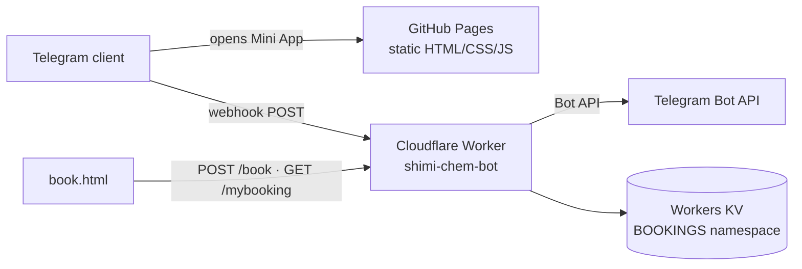

# shimi-app — Persian chemistry study toolkit (Telegram Mini Apps + Cloudflare Worker)

Static Telegram Mini Apps and print tooling for a Persian chemistry-education channel,
plus a Cloudflare Worker that implements the channel bot's Telegram webhook: pinned-hub
sync, channel audit utilities, and the class-booking backend.

## Live pages (HTTP-verified 2026-10-03)

| Page | What it is | URL |
|---|---|---|
| quiz (`index.html`) | Interactive chemistry quiz — timer + score report; runs as a Telegram Mini App (uses `telegram-web-app.js` and TG theme vars) | https://mrrooobooot.github.io/shimi-app/ |
| `planner.html` | Zero-scroll weekly study planner — Jalali month grid × part-of-day slots, progress saved in `localStorage` | https://mrrooobooot.github.io/shimi-app/planner.html |
| `shimidle.html` | "Shimidle Pro" — periodic-table element-guessing game | https://mrrooobooot.github.io/shimi-app/shimidle.html |
| `book.html` | Class booking form (name / grade / contact / topic / preferred time) with a tracking code, backed by the Worker | https://mrrooobooot.github.io/shimi-app/book.html |

All four pages answered HTTP 200 on 2026-10-03.

## Architecture



- **Pages** are plain static files — no build step, no framework, no runtime dependencies
  beyond Telegram's own web-app script. Deploy = push to `main` (GitHub Pages serves the
  repo root).
- **Worker** (`worker/index.js`, ~870 lines) handles the channel bot's webhook:
  - webhook POSTs validated against the `x-telegram-bot-api-secret-token` header when
    `WEBHOOK_SECRET` is set;
  - pinned-message "hub" sync — merges the hub post's buttons into the bot keyboard
    (with a `?dry=1` dry-run mode that changes nothing);
  - channel audit route — reads the public channel preview (`t.me/s/…`) and checks post
    texts, button labels, and hrefs;
  - bookings — `POST /book` validates input, stores `booking:<id>` in the `BOOKINGS` KV
    namespace, and notifies admins; `GET /mybooking?id=` returns status; an
    admin-key-gated route lists bookings;
  - operational self-heal — `/status` re-asserts the webhook URL (the local polling
    daemon calls `deleteWebhook` on start, which would otherwise leave the bot deaf).
- Admin routes are gated by an `ADMIN_KEY` query parameter; bot token, webhook secret,
  and admin key live as Worker secrets, set at deploy time.

## Repository layout

```
index.html planner.html shimidle.html book.html   # the four pages
assets/                                           # printable PDFs (golden sheets, posters, planners)
tools/                                            # Python generators for those assets
worker/                                           # Cloudflare Worker: index.js, deploy.sh, wrangler.jsonc
```

## Print tooling (`tools/`)

Python scripts generate the channel's printable material — golden sheets (reactions,
acids/bases, periodic table), posters (molar mass, isotopes), and study planners
(weekly / monthly / 24-h exam). Outputs are published under `assets/`. The scripts write
to local absolute paths; adjust them before reuse on another machine.

## Testing & verification (honest)

- `node worker/test_keyboard.mjs` — an assert-based self-check of the pinned-hub keyboard
  merge logic (offline, no network). Passes.
- **No CI and no framework test suite.** The static pages are hand-written HTML/CSS/JS
  with no automated coverage.
- Verification performed for this README: live HTTP probes of the four pages and the
  Worker root (returns `Telegram webhook endpoint is live. Use POST.`, HTTP 200), plus
  the self-check above — all on 2026-10-03.

## Deployment

- **Pages**: push to `main`; GitHub Pages serves the repository root.
- **Worker**: `worker/deploy.sh` — reads the bot token from a local env file at deploy
  time and pushes it as an encrypted Worker secret (never printed, never committed);
  reuses the KV namespace id for `BOOKINGS`.
- Local secrets: `worker/.env.local` (`WEBHOOK_SECRET`, `ADMIN_KEY`) is generated with
  `chmod 600` and is gitignored.

## Status & limitations (honest)

- Personal/educational project serving one Telegram channel; no user metrics are
  tracked or claimed.
- The Worker is stateless apart from the `BOOKINGS` KV namespace.
- No license specified yet (owner decision).
